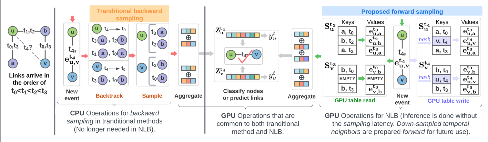

<h1 align="center">No Need to Look Back: An Efficient and Scalable Approach for Temporal
Network Representation Learning</h1>
<p align="center">
<!--     <a href="https://arxiv.org/abs/2209.01084"></a> -->
<!--     <a href="https://github.com/Graph-COM/Neighborhood-Aware-Temporal-Network"></a> -->
    <!---<a href="https://proceedings.mlr.press/v162/miao22a.html">  </a>---!>
</p>

This repository contains the official implementation of NLB as described in the paper: [No Need to Look Back: An Efficient and Scalable Approach for Temporal
Network Representation Learning).

## Introduction
Temporal graph representation learning (TGRL) is crucial for modeling complex, dynamic systems in real-world networks. Traditional TGRL methods, though effective, suffer from high computational demands and inference latency. This is mainly induced by their inefficient sampling of temporal neighbors by backtracking the interaction history of each node when making model inference. This paper introduces a novel efficient TGRL framework, ***N**o-**L**ooking-**B**ack* (NLB). 
NLB employs a "forward recent sampling" strategy, which bypasses the need for backtracking historical interactions. This strategy is implemented using a GPU-executable size-constrained hash table for each node, recording down-sampled recent interactions, which enables rapid response to queries with minimal inference latency. The maintenance of this hash table is highly efficient, with $O(1)$ complexity. NLB is fully compatible with GPU processing, maximizing programmability, parallelism, and power efficiency. Empirical evaluations demonstrate that NLB matches or surpasses state-of-the-art methods in accuracy for link prediction and node classification across six real-world datasets. Significantly, it is 1.32-4.40 $\times$ faster in training, 1.2-7.94 $\times$ more energy efficient, and 1.97-5.02 $\times$ more effective in reducing inference latency compared to the most competitive baselines.

<p align="center"></p>
<p align="center"><em>Figure 1.</em> NLB abandons the backward sampling in traditional methods and adopts forward sampling. For inference, it directly
looks up the down-sampled temporal neighbors from GPU hash tables for aggregation and prediction without being slowed down by
the sampling operations. The new interaction can replace older temporal neighbors in the hash tables leveraging hash collision with
complexity $O(1)$. The updated hash tables capture the new down-sampled temporal neighbors for use later on. See paper for details.</p>

## Requirements
* `python >= 3.7`, `PyTorch >= 1.9`, please refer to their official websites for installation details.
* Other dependencies:
```{bash}
pandas==1.4.3
tqdm==4.41.1
numpy==1.23.1
scikit_learn==1.1.2
```
Refer to `environment.yml` for more details.

We have tested our code on `Python 3.9` with `PyTorch 1.9.0`, and `CUDA 12.3`. Please follow the following steps to create a virtual environment and install the required packages.

Create a virtual environment:
```
conda create --name nlb python=3.9 -y
conda activate nlb
```

Install dependencies:
```
conda install -y pytorch==1.9.0 torchvision==0.10.0 torchaudio==0.9.0 cudatoolkit=10.2 -c pytorch
pip install -U scikit-learn
conda install tqdm==4.41.1
```


## Training Commands

#### Examples:

* To train **NLB-edge** with Wikipedia dataset in transductive training, with 20 down-sampled temporal neighbors, 100 dims for node status, and with replacement probability alpha 0.8:
```bash
python main.py -d WIKI --pos_dim 0 --bs 100 --n_degree 20 --n_hop 1 --mode t --bias 1e-5 --verbosity 1 --drop_out 0.2 --attn_dropout 0.2 --attn_n_head 2 --self_dim 100 --replace_prob 0.8 --lr 0.0001 --time_dim 100 --n_epoch 30 --gpu 0 --seed 21 --run 5
```
To train **NLB-edge** in inductive training, change `mode` from `t` to `i`. Here is an example of inductive training on Reddit with 20 down-sampled temporal neighbors, 100 dims for node status, and with replacement probability alpha 0.9.
```bash
python main.py -d REDDIT --bs 100 --n_degree 1 --n_hop 1 --mode i --bias 1e-5 --verbosity 1 --drop_out 0.2 --attn_dropout 0.2 --attn_n_head 2 --self_dim 100 --replace_prob 0.9 --lr 0.0001 --time_dim 100 --n_epoch 30 --gpu 0 --seed 21 --run 5
```

To run **NLB-edge** for node classification, use the `main_node.py`. Here is an example of node classification on Reddit with 20 down-sampled temporal neighbors, 100 dims for node status, and with replacement probability alpha 0.9.
```bash
python main_node.py -d REDDIT --pos_dim 1 --bs 100 --n_degree 20 --n_hop 1 --mode t --bias 1e-5 --verbosity 1 --drop_out 0.2 --attn_dropout 0.2 --attn_n_head 2 --self_dim 100 --replace_prob 0.9 --lr 0.0001 --time_dim 100 --run 1 --n_epoch 30 --gpu 0 --seed 21 --run 5 --model_path ${your_best_model_path}
```
Use `--nlb_node` to switch to **NLB-node**.

## Usage Summary
```
usage: Interface for NLB [-h] [-d {GDELT,REDDIT,WIKI,MAG,UBUNTU,WIKITALK}]                                                                                                          
                         [-m {t,i}] [--n_degree [N_DEGREE [N_DEGREE ...]]]                                                                                                           
                         [--n_hop N_HOP] [--bias BIAS] [--pos_dim POS_DIM]                                                                                                           
                         [--self_dim SELF_DIM] [--nlb_node]                                                                                                                          
                         [--attn_n_head ATTN_N_HEAD] [--time_dim TIME_DIM]                                                                                                           
                         [--n_epoch N_EPOCH] [--bs BS] [--lr LR]                                                                                                                     
                         [--drop_out DROP_OUT] [--attn_dropout ATTN_DROPOUT]                                                                                                         
                         [--replace_prob REPLACE_PROB] [--tolerance TOLERANCE]                                                                                                       
                         [--seed SEED] [--gpu GPU] [--verbosity VERBOSITY]                                                                                                           
                         [--run RUN] [--model_path MODEL_PATH] 
```

### optional arguments:
```
  -h, --help            show this help message and exit
  -d {GDELT,REDDIT,WIKI,MAG,UBUNTU,WIKITALK}, --data {GDELT,REDDIT,WIKI,MAG,UBUNTU,WIKITALK}                                                                                        
                        data sources to use, try WIKI or REDDIT
  -m {t,i}, --mode {t,i}
                        transductive (t) or inductive (i)
  --n_degree [N_DEGREE [N_DEGREE ...]]
                        a list of neighbor sampling numbers for different
                        hops, when only a single element is input n_layer will
                        be activated
  --n_hop N_HOP         number of hops is used
  --bias BIAS           the hyperparameter alpha controlling sampling
                        preference with time closeness, default to 0 which is
                        uniform sampling
  --pos_dim POS_DIM     dimension of the positional embedding
  --self_dim SELF_DIM   dimension of the self representation
  --nlb_node            whether use NLB-node or NLB-edge. NLB-edge by default.
  --attn_n_head ATTN_N_HEAD
                        number of heads used in tree-shaped attention layer,
                        we only use the default here
  --time_dim TIME_DIM   dimension of the time embedding
  --n_epoch N_EPOCH     number of epochs
  --bs BS               batch_size
  --lr LR               learning rate
  --drop_out DROP_OUT   dropout probability for all dropout layers
  --attn_dropout ATTN_DROPOUT
                        dropout probability for attn weights
  --replace_prob REPLACE_PROB
                        probability for inserting new interactions to
                        downsampled temporal neighbors
  --tolerance TOLERANCE
                        tolerated marginal improvement for early stopper
  --seed SEED           random seed for all randomized algorithms
  --gpu GPU             which gpu to use
  --verbosity VERBOSITY
                        verbosity of the program output
  --run RUN             number of model runs
  --model_path MODEL_PATH
                        path to NLB trained model to be loaded
```

## Instructions on Acquiring Datasets

The Wikipedia, Reddit, GDELT and MAG datasets can be accessed through the TGL [Repo](https://github.com/amazon-science/tgl/blob/main/down.sh).
Raw data for Ubuntu can be downloaded using this [link](https://snap.stanford.edu/data/sx-askubuntu.txt.gz) and Wiki-talk using this [link](https://snap.stanford.edu/data/wiki-talk-temporal.txt.gz) to `DATA`. Rename the files to `UBUNTU.txt` and `WIKITALK.txt` and run the following to preprocess the data.
```{bash}
python process.py --dataset UBUNTU
python process.py --dataset WIKITALK
```
Before running node classification, we require an extra processing to assign the node labels to specific links for easiness of learning node representations.

```{bash}
python process_for_node_classification.py -d ${DATA_NAME}
```


#### Use your own data
Put your data under `DATA/${DATA_NAME}` folder. The required input data includes `edges.csv`. The optional input data includes `labels.csv`, `edge_features.pt` and `node_features.pt`. They store the node labels, edge features and node features respectively.

The `edges.csv` file has following columns
```
u, i, ts, label, idx
```
, which represents source node index, target node index, time stamp, edge label and the edge index.

`edge_features.pt` has shape of [#temporal edges, edge features dimention]. `node_features.pt` has shape of [#nodes + 1, node features dimension].


All node index starts from `1`. The zero index is reserved for `null` during padding operations. So the maximum of node index equals to the total number of nodes. Similarly, maxinum of edge index equals to the total number of temporal edges. The padding embeddings or the null embeddings is a vector of zeros.

## Acknowledgement
Our implementation adapts the code [here](https://github.com/snap-stanford/CAW) as the code base and extensively adapts it to our purpose. We also adapts an efficient implementation of GAT [here](https://github.com/gordicaleksa/pytorch-GAT)  for the output attention layer. We thank the authors for sharing their code.
```
